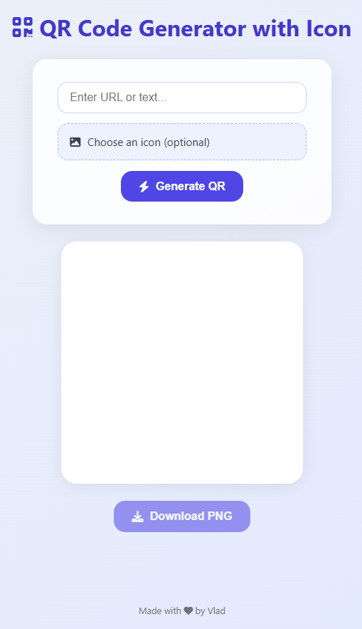

# QRGen Icon – QR Code Generator with Custom Icon

**QRGen Icon** is a simple and responsive web app that allows you to generate high-resolution QR codes (up to 4K) with optional custom icons at the center.

🔗 **Live Demo**: [https://yourusername.github.io/qrgen-icon](https://yourusername.github.io/qrgen-icon)

## 🌟 Features

- Custom text or URL input
- Add an optional icon (image) in the center of the QR
- Responsive and modern UI
- Export to PNG (4096x4096 resolution)
- 100% client-side – no server required

## 🖼️ Screenshot

 <!-- Add your own screenshot -->

## 🛠️ Built With

- HTML5 + CSS3
- JavaScript (Vanilla)
- [QR Code Styling](https://github.com/kozakdenys/qr-code-styling)
- [Font Awesome](https://fontawesome.com/)

## 🧾 Credits

- Developed by **Vlad**
- QR rendering: [qr-code-styling](https://github.com/kozakdenys/qr-code-styling)
- Icons: [Font Awesome](https://fontawesome.com/)

## 📄 License

This project is licensed under the [MIT License](LICENSE.txt)

You are free to use, modify, and share this project.  
If you reuse or adapt it, a mention or link back would be appreciated.
